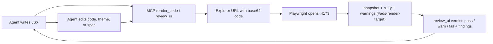

# ADS Light Architecture

ADS Light stands on an accessible ShadCN foundation (Radix UI primitives + Tailwind CSS v4 + class-variance-authority, TypeScript) and adds an agentic layer around it. The foundation supplies accessible components; ADS Light supplies queryable rules, brand tokens, rendering, and verification.

## Pillars

1. `CLAUDE.md` and `AGENT_GUIDE.md`: behavior rules and decision tree.
2. **Agentic layer** (`mcp-server/index.js` + `mcp-server/agentic.js`): the MCP server exposes 23 tools, 5 resources, and 3 prompts so an agent operates the system end to end. Beyond query / render / theme / spec editing, it adds `recommend_component` (NL task → ranked components), `capabilities` (what the system can / can't do), `scaffold_screen` (brief → render-verified patterns + recommended components), `review_ui` (render JSX → `pass`/`warn`/`fail` verdict + structured findings against the design rules), and `apply_brand` (import a brand profile → theme). Resources `ads://components`, `ads://patterns`, `ads://tokens`, `ads://theme`, `ads://capabilities` expose the system as readable context; prompts `build_screen`, `theme_from_brand`, `review_before_ship` encode the standard flows. The intended loop is `recommend_component` → `get_component` → compose → `review_ui` (self-check, fix findings) → deliver. See the Render-Verify Loop below.
3. `ads.components.json`: flat machine-readable specs for the 123 components, with variants, states, props, usage rules, and JSX examples. (shadcn's CLI owns the root `components.json` for its own config, so the ADS spec is namespaced.) The roster is the shadcn foundation + ADS primitives + typography + custom components + the newer NavigationMenu / Menubar / ContextMenu / Chart; `sidebar` is intentionally excluded. Status intent is first-class — `success` / `warning` / `info` join `destructive` on Button (9 variants), Alert, Badge, Progress `variant`, and ProgressCircle `tone` — all from semantic tokens.
4. `patterns.json`: 14 composition patterns (multi-component recipes — forms, table + toolbar, settings, auth, loading, error, …) with intent, selection rules, and executable JSX; exposed via `list_patterns`/`search_patterns`/`get_pattern` and re-exported by `src/patterns/composition-patterns.ts`.
5. `src/meta`: rich per-component contracts for axes, relationships, a11y, tokens, and AI hints.
6. Component sources: copied shadcn source files under `src/components/ui`, plus ADS-authored `src/components/primitives.tsx`, `src/components/typography.tsx`, and `src/components/ads/*.tsx`.
7. `src/App.tsx`: live render explorer served by Vite, driven by URL params for automation, with a live Controls panel and a Tokens view over the generated token catalog.
8. `client-theme.json` → `scripts/generate-theme.mjs`: the one source of truth for branding. It emits **both** the render CSS variables in `src/theme/tokens.generated.css` (shadcn `--primary`, `--background`, `--border`, `--radius`, plus the brand / status / neutral ramps and `--success`/`--warning`/`--info`, light + dark) **and** a brand-reactive token catalog in `src/tokens/token-data.generated.js` (~164 tokens) that the explorer Tokens view browses. `src/index.css` is the Tailwind v4 entry (`@import "tailwindcss"`, `@theme inline` token mapping, `.dark` variant).

## Render-Verify Loop

The render tools don't just return a screenshot. Playwright renders the JSX, then a serialized snapshot function (`SNAPSHOT_FN` in `mcp-server/agentic.js`) runs in the page and returns a machine-readable `snapshot` — visible text, interactive elements, the primary element's computed styles (background / color / border / radius / font), and overflow / nested-card flags — alongside an `a11y` block (serious/critical axe violations) and `warnings` on hardcoded colors. `review_ui` consumes that same render and grades it against the design rules (hardcoded colors, multiple primary actions, raw HTML elements, nested cards, overflow, render errors, a11y), returning a `pass`/`warn`/`fail` verdict with structured findings and fixes. The upshot: a non-vision agent can verify and self-correct from JSON, not pixels.

## Brand-Import Path

A brand profile (`brand-profile.example.json` shows the shape; only `colors.primary` is essential) becomes a theme in one step, via `apply_brand` (MCP) or `npm run import-brand -- <profile.json>` (`scripts/apply-brand.mjs`). The mapping (`mapBrandToTheme` in `mcp-server/agentic.js`) writes the brand colors into `client-theme.json`, **derives missing color stops** (e.g. brand 50/100/600/700 from a single primary), then regenerates the theme via `generate-theme.mjs`. Contrast is validated against WCAG AA (`validateThemeContrast`) and any failing pairs are reported; `set_theme` runs the same contrast check. After import, render a few components to verify before committing `client-theme.json`.

## URL Contract

- `/?component=Button` selects a known component from the registry (`src/components/registry.ts`, sourced from `ads.components.json`).
- `/?code=<base64url>` renders arbitrary JSX.
- `/?colorMode=dark` renders the target in dark mode (applies a `.dark` ancestor so the dark-mode CSS variables resolve). Defaults to light.
- Control params drive the live Controls panel, e.g. `/?variant=destructive` (plus `size`, `state`, and boolean props).
- JSX snippets have all ADS Light component exports and selected lucide icons in scope.
- The render target is always `#ads-render-target`.
- MCP render tools also accept `colorMode` (`light`/`dark`) and `viewport` (`mobile`/`tablet`/`desktop`).

## Per-Client Workflow

1. Create a branch for the client.
2. Set the brand: either import a brand profile (`apply_brand` / `npm run import-brand -- <profile.json>`, which writes `client-theme.json` and regenerates) or edit `client-theme.json` directly and run `npm run generate:theme` to recompile both `src/theme/tokens.generated.css` and `src/tokens/token-data.generated.js`.
3. Add optional client-only components to `ads.components.json`.
4. Render representative states with the MCP server; `review_ui` for a verdict.
5. Run `npm run lint:ui` to catch hardcoded colors / raw elements in any source you touched, and deliver only after screenshot verification.

## Scripts

- `npm run dev`: local Vite development server.
- `npm run preview`: production preview on `127.0.0.1:4173`.
- `npm run build`: build the explorer.
- `npm run mcp`: start ADS Light MCP over stdio.
- `npm run import-brand -- <profile.json>`: map a brand profile into `client-theme.json`, derive missing color stops, validate AA contrast, and regenerate the theme (`scripts/apply-brand.mjs`).
- `npm run render -- "<Button>Preview</Button>"`: screenshot a snippet into `artifacts/`.
- `npm run render -- --url http://127.0.0.1:4180 "<Button>Preview</Button>"`: screenshot against a non-default port.
- `npm run generate:theme`: compile `client-theme.json` into both `src/theme/tokens.generated.css` (shadcn CSS variables, light + dark) and `src/tokens/token-data.generated.js` (~164-token brand-reactive catalog).
- `npm run lint:ui`: scan real `.tsx`/`.jsx` source for hardcoded colors and raw `<button>`/`<input>` elements; CI-ready (non-zero exit on findings).
- `npm run generate`: full chain — `generate:theme` → `generate:icons` → `apply:shadcn-base` → `enrich:components` → `generate:rich-meta` → `quality`. `apply:shadcn-base` merges ground-truth base fields from `scripts/shadcn-manifest.json` into the spec via `scripts/apply-shadcn-base.mjs`; `enrich:components` (`scripts/enrich-component-metadata.mjs`) derives the rich metadata (controls / propMetadata / variantMetadata / etc.).
- `npm run validate:specs`: validate every `ads.components.json` spec against the add/update contract; non-zero exit on failure.
- `npm run generate:inert-controls`: render every component, drive each control, and write `src/generated/inert-controls.generated.json` listing controls that don't change the render (the underlying component has no such prop, or the preview fixes that state). The explorer hides those, so every control shown actually does something. Re-run after component-library upgrades or spec changes.
- `npm run verify:renders`: render every component and composition pattern, run an axe-core a11y pass, assert the brand button resolves to the brand color, and write `artifacts/render-status.json`. a11y violations warn by default; `ADS_VERIFY_STRICT=1` (or `--strict`) makes them fail the run.
- `npm run baseline:capture`: capture golden screenshots of every component into `artifacts/baseline/`.
- `npm run verify:visual`: pixel-diff every component against its baseline and flag drift into `artifacts/visual-diff/` (threshold via `ADS_VISUAL_THRESHOLD`). Run after `baseline:capture` and re-capture intentionally when a theme/spec change is approved.
- `npm test`: `validate:specs` + `build` + `verify:renders`.

If the render script cannot reach the requested explorer URL, it serves the built `dist/` folder on a temporary localhost port and still writes the screenshot.

## Verification Signals

- `quality_report` reads `artifacts/render-status.json` and scores an `exampleVerified` check, so a spec cannot score high unless its example actually renders cleanly. Run `npm run verify:renders` to refresh it.
- The MCP render tools (`render_code`, `render_component`, `render_controlled_component`) return a machine-readable `snapshot` (text, interactive elements, primary computed styles, overflow / nested-card flags) plus an `a11y` block with serious/critical axe violations; `ok` is false when the render fails, logs console errors, or has violations.
- Those render tools also return a `warnings` array flagging hardcoded colors (raw hex / `rgb()` / `hsl()`) in the submitted JSX — enforcing the no-hardcoded-color brand rule at the point where agents generate UI.
- `review_ui` renders the same way and returns a `pass`/`warn`/`fail` verdict with structured findings (each with a fix) against the design rules, so an agent can self-check and correct generated UI before delivering.
- `npm run lint:ui` extends the no-hardcoded-color / prefer-component checks to real `.tsx`/`.jsx` source (not just submitted snippets), suitable for CI.
- `verify:visual` pixel-diffs every component against `artifacts/baseline/`; a theme/spec edit that shifts rendered output is flagged instead of shipping silently.
- `verify:renders` carries a small `KNOWN_A11Y_ISSUES` map for genuine markup quirks a preview snippet cannot fix. Exclusions are scoped to one rule on one component, recorded per component as `knownIssues`, and should be revisited on each component-library upgrade.
- Spec and theme writes (`add_component`, `update_component`, `set_theme`) are serialized per file and written atomically (temp file + rename), so concurrent agent calls cannot clobber each other.
- Explorer controls apply by overriding the preview snippet's own props in place (no duplicate attributes) and only when changed from default, so curated previews stay intact until tuned. Controls map to the component's real props (e.g. Button `variant` / `size`) and Tailwind utility classes. Controls proven inert are hidden via the generated map above (`?auditControls=1` bypasses the hide so the generator can re-test the unfiltered panel).
