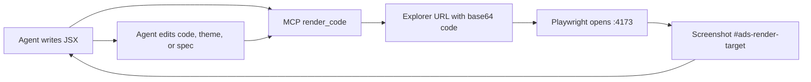

# ADS Light Architecture

ADS Light stands on an accessible component foundation and adds an agentic layer around it. The foundation supplies accessible components; ADS Light supplies queryable rules, brand tokens, rendering, and verification.

## Pillars

1. `CLAUDE.md` and `AGENT_GUIDE.md`: behavior rules and decision tree.
2. `mcp-server/index.js`: agent tools for query, render, theme, and spec editing.
3. `components.json`: flat machine-readable component specs with variants, states, props, usage rules, and JSX examples.
4. `patterns.json`: composition patterns (multi-component recipes) with intent, selection rules, and executable JSX; exposed via `list_patterns`/`search_patterns`/`get_pattern` and re-exported by `src/patterns/composition-patterns.ts`.
5. `src/meta`: rich per-component contracts for axes, relationships, a11y, tokens, and AI hints.
6. `src/tokens`: primitive, typography, semantic, and component CSS token layers.
7. `src/App.jsx`: live render explorer served by Vite, driven by URL params for automation.
8. `client-theme.json` and `src/theme/createTheme.js`: the client brand layer applied globally through the component foundation's theming.

## Render-Verify Loop

## URL Contract

- `/?component=Button` selects a known component from `components.json`.
- `/?code=<base64url>` renders arbitrary JSX.
- `/?colorMode=dark` renders the target in dark mode (applies a `.dark` ancestor so `_dark` tokens resolve). Defaults to light.
- JSX snippets have all ADS Light component exports and selected lucide icons in scope.
- The render target is always `#ads-render-target`.
- MCP render tools also accept `colorMode` (`light`/`dark`) and `viewport` (`mobile`/`tablet`/`desktop`).

## Per-Client Workflow

1. Create a branch for the client.
2. Change `client-theme.json`.
3. Add optional client-only components to `components.json`.
4. Render representative states with the MCP server.
5. Deliver only after screenshot verification.

## Scripts

- `npm run dev`: local Vite development server.
- `npm run preview`: production preview on `127.0.0.1:4173`.
- `npm run build`: build the explorer.
- `npm run mcp`: start ADS Light MCP over stdio.
- `npm run render -- "<Button>Preview</Button>"`: screenshot a snippet into `artifacts/`.
- `npm run render -- --url http://127.0.0.1:4180 "<Button>Preview</Button>"`: screenshot against a non-default port.
- `npm run generate`: refresh generated token, icon, and component metadata artifacts.
- `npm run validate:specs`: validate every `components.json` spec against the add/update contract; non-zero exit on failure.
- `npm run generate:inert-controls`: render every component, drive each control, and write `src/generated/inert-controls.generated.json` listing controls that don't change the render (the underlying component has no such prop, or the preview fixes that state). The explorer hides those, so every control shown actually does something. Re-run after component-library upgrades or spec changes.
- `npm run verify:renders`: render every component and composition pattern, run an axe-core a11y pass, assert the brand button resolves to the brand color, and write `artifacts/render-status.json`. a11y violations warn by default; `ADS_VERIFY_STRICT=1` (or `--strict`) makes them fail the run.
- `npm run baseline:capture`: capture golden screenshots of every component into `artifacts/baseline/`.
- `npm run verify:visual`: pixel-diff every component against its baseline and flag drift into `artifacts/visual-diff/` (threshold via `ADS_VISUAL_THRESHOLD`). Run after `baseline:capture` and re-capture intentionally when a theme/spec change is approved.
- `npm test`: `validate:specs` + `build` + `verify:renders`.

If the render script cannot reach the requested explorer URL, it serves the built `dist/` folder on a temporary localhost port and still writes the screenshot.

## Verification Signals

- `quality_report` reads `artifacts/render-status.json` and scores an `exampleVerified` check, so a spec cannot score high unless its example actually renders cleanly. Run `npm run verify:renders` to refresh it.
- The MCP render tools (`render_code`, `render_component`, `render_controlled_component`) return an `a11y` block with serious/critical axe violations; `ok` is false when the render fails, logs console errors, or has violations.
- Those render tools also return a `warnings` array flagging hardcoded colors (raw hex / `rgb()` / `hsl()`) in the submitted JSX — enforcing the no-hardcoded-color brand rule at the point where agents generate UI.
- `verify:visual` pixel-diffs every component against `artifacts/baseline/`; a theme/spec edit that shifts rendered output is flagged instead of shipping silently.
- `verify:renders` carries a small `KNOWN_A11Y_ISSUES` map for genuine upstream component-library markup quirks a preview snippet cannot fix (currently only `Steps` → `aria-required-children`, where `Steps.Item` nests a `div[aria-current]` inside `role="tablist"`). Exclusions are scoped to one rule on one component, recorded per component as `knownIssues`, and should be revisited on each component-library upgrade.
- Spec and theme writes (`add_component`, `update_component`, `set_theme`) are serialized per file and written atomically (temp file + rename), so concurrent agent calls cannot clobber each other.
- Explorer controls apply by overriding the preview snippet's own props in place (no duplicate attributes) and only when changed from default, so curated previews stay intact until tuned. Box/icon primitives map `size` to a concrete `boxSize`; typography maps `size` to `fontSize`; Flex/Stack map `variant` to `direction`. Controls proven inert are hidden via the generated map above (`?auditControls=1` bypasses the hide so the generator can re-test the unfiltered panel).
